# 校园学术智能RAG检索系统 - 项目执行与迭代纲领文档
> 【强制执行指令 - 致Claude Code】
> 本文档是本项目的**唯一执行宪法与迭代准则**，你在本项目中的所有代码编写、功能实现、架构设计、自我迭代升级，必须100%遵守本文档的全部规则与要求。
> 1. 严禁修改本文档的核心定位、核心执行准则、迭代边界与禁止项；
> 2. 所有开发必须先完成本文档规定的MVP核心路径，再按优先级扩展增强技术栈；
> 3. 每一次代码修改、功能新增、技术栈升级，必须同步更新本文档对应内容，确保文档与代码100%一致；
> 4. 所有迭代必须以「提升校园学术文档检索精准度、降低回答幻觉、贴合校园学习科研场景」为唯一核心目标，严禁偏离；
> 5. 你拥有本文档规则框架内的自主迭代权限，可基于行业最佳实践、性能评估结果、用户合理需求，自主优化新增符合核心定位的功能与技术栈，但必须严格遵守本文档的迭代流程与验收标准。

---

## 一、项目核心信息
| 项目项 | 详情 |
|--------|------|
| 项目名称 | 校园学术智能RAG检索系统 |
| 核心定位 | 专为校园学习科研场景打造的私有化RAG问答系统，将课程PPT、课本PDF、学术论文等学术文档转化为可精准检索的知识库，解决大模型校园场景回答幻觉、知识点不精准、脱离教材/课程内容的核心痛点 |
| 目标用户 | 在校学生、授课教师、科研人员 |
| 核心文档范围 | 课程PPT、教材PDF、学术论文、课程讲义、习题解析、实验指导书等校园学术文档 |
| 版本号 | v1.0.0 |
| 生效日期 | 2026年04月 |

---

## 二、不可突破的核心执行准则
本准则为项目的核心锚点，任何迭代、功能新增都不得突破以下规则：
1.  **核心不偏移原则**：所有功能必须服务于「校园学术文档的精准检索+低幻觉专业问答」，不得改造为通用聊天RAG、非学术场景RAG系统。
2.  **数据安全优先原则**：所有校园私有文档默认本地存储、本地处理，未经用户明确授权，严禁上传至任何第三方服务；支持完全离线部署，适配校园内网环境。
3.  **渐进式迭代原则**：必须先完成MVP核心功能并通过验收，再按优先级迭代增强功能，每一次迭代必须保留上一版本的稳定能力，不得破坏核心功能。
4.  **可复现可追溯原则**：所有代码、配置必须可直接运行，无魔法代码、无缺失依赖；所有生成的回答必须可溯源到对应文档的对应分片，支持用户核验原文。
5.  **合规性原则**：严格遵守知识产权相关规定，仅支持用户拥有合法使用权的文档处理；不得提供违反学术规范、考试纪律的功能（如作弊、论文代写等）。

---

## 三、已确定的核心技术方案（必须100%落地）
### 3.1 文档分片策略
核心采用**按句分片**为基础的优化分片方案，具体规则：
1.  基础粒度：以完整句子为最小分片单元，适配学术文档的严谨句式结构，避免语义断裂。
2.  滑动窗口增强：采用「N句连续分片+1-2句重叠」的滑动窗口机制，默认3句为一个分片单元，相邻分片重叠1句，解决单句上下文缺失的问题。
3.  分片边界控制：对标题、公式、图表注释、段落边界做特殊处理，严禁将同一段落的核心语义、同一个公式、同一个图表的说明拆分到不同分片。
4.  元数据绑定：每个分片必须绑定对应元数据（文档名称、文档类型、章节、页码、作者、发布时间等），为后续检索过滤、溯源提供支撑。

### 3.2 检索核心策略
1.  **Top-K精准检索**：基础检索采用Top-K召回机制，支持动态K值调整，默认K=10，可根据问题复杂度、文档总量自动适配。
2.  **多路归并召回策略**：采用多通道召回+结果归并融合的核心架构，基础通道包括：
    - 向量语义检索通道：基于嵌入模型的语义匹配召回
    - 关键词精准检索通道：基于BM25/TF-IDF的关键词匹配召回
    - 元数据过滤通道：基于文档类型、章节、课程等元数据的精准过滤召回
    - 归并规则：对多通道召回结果进行去重、加权打分、重排序，最终输出最优的Top-K结果，解决单一检索通道的召回盲区问题。

### 3.3 多Agent协作（类MoE机制）架构
采用**校园场景专属的MoE式多Agent协作架构**，每个Agent为对应场景的专家模块，通过门控路由机制调度，核心Agent模块及职责如下：
| Agent名称 | 核心职责 | 激活场景 |
|-----------|----------|----------|
| 文档解析专家Agent | 负责各类校园文档的结构化解析、格式处理、公式识别、分片处理 | 文档入库、增量更新时 |
| 检索调度专家Agent | 负责检索策略调度、多路归并执行、Top-K结果筛选、检索结果二次优化 | 用户提问检索阶段 |
| 知识校验专家Agent | 负责校验生成内容与检索文档的一致性、识别幻觉、核对知识点准确性、标注溯源引用 | 回答生成后、输出前 |
| 校园场景生成专家Agent | 负责贴合校园场景的回答生成，支持考点梳理、作业答疑、论文解读、公式推导等专属格式 | 回答生成阶段 |
| 系统迭代优化Agent | 负责系统性能监控、用户反馈收集、参数优化、迭代需求评估、文档同步更新 | 系统运行全周期，驱动自我迭代 |

- 路由机制：基于用户问题类型、场景，自动激活对应的专家Agent，非相关Agent不参与执行，类MoE的稀疏激活机制，提升响应效率与回答专业性。
- 协作规则：所有Agent必须基于检索到的知识库内容执行操作，严禁脱离知识库生成无依据内容，最终输出必须经过知识校验专家Agent的幻觉校验。

---

## 四、可迭代增强的技术栈（按优先级排序）
你可基于项目进度、性能评估结果，按优先级自主迭代加入以下技术栈，所有技术栈必须服务于核心目标，不得添加无关功能。

### 4.1 文档解析增强（最高优先级，校园场景刚需）
1.  **学术文档结构化解析**：针对论文/教材/PPT的专属结构化解析能力
    - 论文：自动拆分摘要、引言、实验方法、结果、结论、参考文献、公式、图表等模块
    - 教材PDF：自动识别章节、小节、标题层级、公式、注释、习题等结构
    - 课程PPT：自动识别标题、正文、备注、图表、知识点层级，分离版式噪声
2.  **公式与图表识别能力**：集成LaTeX-OCR实现数学公式精准识别与格式保留；集成OCR能力实现扫描版PDF、图片型PPT/教材的文字、图表识别
3.  **多格式全兼容**：支持PDF、PPT/PPTX、Word/DOCX、Markdown、TXT、图片格式等全校园常见文档格式
4.  **增量文档更新**：支持新增文档的增量解析、增量嵌入、增量索引构建，无需全量重建知识库，适配课程资料持续更新的场景

### 4.2 检索能力增强（高优先级，核心效果提升）
1.  **混合检索与重排序增强**：在多路归并基础上，集成BGE-Reranker/ColBERT等专业重排序模型，对召回结果进行二次精排，大幅提升检索精准度
2.  **HyDE假设文档增强**：针对长尾问题、模糊问题，先生成假设性的答案文档，再基于假设文档进行检索，提升低频次知识点的召回率
3.  **元数据精准过滤**：支持按课程名称、章节、文档类型、发布时间、作者等多维度过滤检索范围，例如「仅检索《计算机网络》第3章的PPT内容」
4.  **动态检索策略**：根据问题类型自动调整检索策略，例如概念类问题增加关键词权重，推导类问题增加上下文语义权重，习题类问题优先匹配例题与解析
5.  **RAG-Fusion融合检索**：基于用户问题生成多个相关子查询，多路并行检索后进行结果融合，解决单一问题表述的检索局限性

### 4.3 生成与抗幻觉增强（高优先级，核心体验提升）
1.  **Self-RAG自我反思检索**：生成过程中自动判断当前检索内容是否足够支撑回答，若信息不足自动触发补充检索，直至信息足够生成精准答案
2.  **Chain-of-Verification校验链**：回答生成后，自动执行多轮事实校验，核对每一个知识点与知识库原文的一致性，识别并删除幻觉内容，确保回答100%基于知识库
3.  **全链路引用溯源**：回答中的每一个知识点、数据、结论，都必须标注对应的来源文档、页码、分片位置，支持用户一键跳转核验原文
4.  **校园场景专属生成格式**：支持多种校园场景的输出格式，包括考点梳理、知识点思维导图、作业解答步骤、论文核心观点总结、公式推导过程、考试重点划记等
5.  **多轮对话上下文感知**：支持多轮对话，自动关联上文的知识点、文档范围，避免重复提问，适配课程学习、论文研读的长对话场景

### 4.4 多Agent/MoE架构增强（中优先级，能力边界扩展）
1.  **细分场景专家Agent扩展**：新增更多校园专属专家Agent，包括公式推导Agent、考点预测Agent、论文润色Agent、实验报告生成Agent、习题解答Agent等，每个Agent有专属的Prompt与能力边界
2.  **MoE门控机制优化**：优化Agent路由的精准度，基于问题类型、用户场景，精准激活最少的必要专家Agent，提升执行效率
3.  **Agent反馈闭环**：用户对回答的纠错、评分、补充，自动同步到对应Agent，优化Agent的Prompt、执行逻辑、检索策略，实现自我优化
4.  **多Agent辩论校验机制**：针对高复杂度的学术问题，激活多个专家Agent并行生成答案，交叉校验、辩论纠错，最终输出最优解，进一步降低幻觉

### 4.5 系统工程与部署能力增强（中优先级，落地性提升）
1.  **多模型适配能力**：同时支持云端API（Claude 3系列、OpenAI系列）与本地开源大模型（Llama3、Qwen2、GLM4等）、本地嵌入模型（BGE、m3e等），适配校园内网离线部署需求
2.  **私有化部署支持**：提供一键部署脚本，支持Docker容器化部署、本地单机部署、校园服务器集群部署
3.  **API接口能力**：提供标准化RESTful API，支持对接校园学习平台、小程序、公众号、企业微信等校园常用终端
4.  **权限与知识库管理**：支持多用户权限管理、多知识库隔离（例如不同课程、不同班级、不同课题组的知识库独立管理）
5.  **性能优化**：高频问题缓存机制、向量索引优化、批量文档处理加速、异步任务队列，提升高并发场景下的响应速度

### 4.6 迭代与运维增强（基础优先级，支撑自我迭代）
1.  **全链路监控体系**：监控检索召回率、回答准确率、幻觉率、响应延迟、系统资源占用等核心指标，自动识别性能瓶颈
2.  **用户反馈闭环系统**：支持用户对回答进行评分、纠错、标注错误来源，系统自动基于反馈优化分片策略、检索权重、Agent执行逻辑
3.  **版本管理与回滚机制**：每一次迭代生成专属版本号，保留稳定版本的完整代码与配置，出现问题可一键回滚
4.  **自动化测试体系**：构建校园场景专属测试集，每一次迭代必须通过自动化测试，确保核心功能不退化、核心指标不下降

---

## 五、系统整体架构设计

```mermaid
flowchart LR
    A[数据层] --> B[文档处理层]
    B --> C[索引与存储层]
    C --> D[检索召回层]
    D --> E[多Agent/MoE协作层]
    E --> F[应用与输出层]
    G[监控与迭代层] --> A & B & C & D & E & F

    subgraph A[数据层]
        A1[课程PPT]
        A2[教材PDF]
        A3[学术论文]
        A4[课程讲义]
        A5[其他校园文档]
    end

    subgraph B[文档处理层]
        B1[多格式解析]
        B2[公式/OCR识别]
        B3[结构化拆分]
        B4[按句分片+滑动窗口]
        B5[元数据绑定]
    end

    subgraph C[索引与存储层]
        C1[向量数据库]
        C2[关键词索引库]
        C3[元数据库]
        C4[文档原始库]
    end

    subgraph D[检索召回层]
        D1[向量语义检索]
        D2[BM25关键词检索]
        D3[元数据过滤检索]
        D4[多路归并融合]
        D5[重排序精排]
        D6[Top-K结果输出]
    end

    subgraph E[多Agent/MoE协作层]
        E1[门控路由模块]
        E2[文档解析专家Agent]
        E3[检索调度专家Agent]
        E4[知识校验专家Agent]
        E5[校园场景生成专家Agent]
        E6[迭代优化专家Agent]
    end

    subgraph F[应用与输出层]
        F1[对话问答界面]
        F2[RESTful API]
        F3[引用溯源展示]
        F4[多格式结果输出]
    end

    subgraph G[监控与迭代层]
        G1[性能指标监控]
        G2[用户反馈收集]
        G3[自动化测试]
        G4[版本迭代管理]
        G5[文档同步更新]
    end
```


---

## 六、MVP核心实现路径（必须优先完成，再迭代扩展）
你必须按以下步骤顺序执行，完成上一步并通过验收后，方可进入下一步，严禁跳步开发。

### 步骤1：环境搭建与项目初始化
- 完成Python环境配置，确定核心依赖库与版本，使用Poetry进行依赖管理
- 完成项目目录结构搭建，配置Git版本管理，生成基础配置文件与环境变量示例
- 验收标准：项目可正常初始化，依赖可一键安装，基础框架可正常运行

### 步骤2：文档解析与分片模块开发
- 实现PDF、PPTX、DOCX等核心格式的基础解析能力
- 实现按句分片+滑动窗口的核心分片逻辑，完成元数据绑定
- 验收标准：可正常解析示例文档，分片符合规范，无语义断裂，元数据完整绑定

### 步骤3：嵌入与索引模块开发
- 集成中文适配的嵌入模型，实现分片内容的向量化
- 搭建向量数据库与关键词索引库，实现索引的构建与存储
- 验收标准：可完成文档的全量索引构建，索引可正常读取与查询

### 步骤4：核心检索模块开发
- 实现向量检索、BM25关键词检索的基础能力
- 实现多路归并融合、重排序、Top-K输出的核心逻辑
- 验收标准：检索召回率符合预期，多路归并可正常执行，可精准返回相关分片

### 步骤5：基础多Agent框架开发
- 实现核心5个Agent的基础能力与门控路由机制
- 实现Agent之间的信息流转与协作逻辑
- 验收标准：可根据用户问题正常调度对应Agent，执行流程符合设计规范

### 步骤6：问答生成与校验模块开发
- 实现基于检索结果的回答生成能力，完成引用溯源功能
- 实现知识校验Agent的幻觉检测、事实核对能力
- 验收标准：回答基于知识库内容，无幻觉，引用溯源完整准确，符合校园场景需求

### 步骤7：自动化测试与MVP验收
- 构建校园场景测试集，完成全流程功能测试与性能测试
- 修复核心bug，优化核心指标，完成MVP版本发布
- 验收标准：全流程可正常运行，核心功能无bug，回答准确率≥95%，幻觉率≤5%

### 步骤8：进入迭代优化周期
- 基于本文档的增强技术栈优先级，逐步迭代新增功能
- 基于监控指标与用户反馈，持续优化核心能力
- 每一次迭代必须同步更新本文档，完成版本发布

---

## 七、自我迭代与升级规则
### 7.1 迭代触发条件
满足以下任一条件，可触发系统自我迭代：
1.  现有功能出现bug、性能瓶颈、安全漏洞；
2.  核心性能指标（召回率、准确率、幻觉率、响应延迟）出现退化，或有明确的优化空间；
3.  用户提出符合核心定位的合理需求，且不突破迭代边界；
4.  有经过验证的、可显著提升核心效果的学术RAG新技术、新方案；
5.  系统监控发现的异常问题、适配性问题。

### 7.2 标准迭代流程
1.  **迭代需求评估**：由迭代优化专家Agent执行，评估需求是否符合核心定位、是否有必要实现、对现有系统的影响，输出迭代评估报告，明确迭代目标与验收指标；
2.  **方案设计**：基于评估报告，设计技术实现方案，明确代码修改范围、架构调整内容、依赖新增情况，确保不破坏现有稳定功能；
3.  **分支开发**：在独立的Git分支中完成代码实现，编写对应的单元测试用例，确保代码符合规范；
4.  **测试验证**：执行自动化测试、全流程回归测试、性能测试，验证迭代目标是否达成，核心指标是否提升，无功能退化；
5.  **文档同步**：同步更新本文档的对应内容，包括技术栈、架构、功能说明、版本号，确保文档与代码完全一致；
6.  **合并发布**：测试通过后，合并到主分支，生成新版本tag，完成版本发布；
7.  **效果复盘**：发布后持续监控新版本的运行情况，复盘迭代效果，若出现问题立即触发回滚。

### 7.3 绝对禁止的迭代边界
严禁进行以下任何形式的迭代与修改：
1.  修改项目核心定位、核心执行准则，将系统改造为非校园学术场景的RAG系统；
2.  添加与核心RAG功能无关的冗余功能，包括但不限于娱乐聊天、通用资讯检索、非学术类服务；
3.  破坏系统的隐私安全，未经用户授权上传私有文档到第三方服务；
4.  提供违反学术规范、知识产权、校园纪律的功能，包括但不限于论文代写、考试作弊、盗版文档处理；
5.  无限制新增依赖，导致系统臃肿、可复现性下降；
6.  修改本文档的强制执行指令、迭代规则、禁止项。

---

## 八、核心性能与效果评估指标
每一次迭代必须基于以下指标进行评估，只有核心指标持平或提升，方可完成迭代合并。

| 指标类型 | 核心指标 | 合格线 | 优化目标 |
|----------|----------|--------|----------|
| 检索效果指标 | 召回率@10 | ≥90% | ≥98% |
|  | 精确率@10 | ≥85% | ≥95% |
|  | MRR均值 | ≥0.85 | ≥0.95 |
| 生成效果指标 | 回答准确率 | ≥95% | ≥99% |
|  | 幻觉率 | ≤5% | ≤1% |
|  | 引用覆盖率 | ≥90% | 100% |
| 系统性能指标 | 单轮问答平均响应延迟 | ≤3s | ≤1s |
|  | 批量文档处理速度 | 100页PDF≤5min | 100页PDF≤2min |
|  | 系统可用性 | ≥99.5% | 99.9% |

---

## 九、项目标准目录结构
你必须严格按照以下目录结构搭建项目，不得随意调整核心目录层级：
```
campus-academic-rag/
├── README.md                          # 项目对外说明文档
├── project-manifest.md                # 本文档（项目执行与迭代纲领，迭代必须同步更新）
├── pyproject.toml                     # Poetry依赖管理文件，锁定所有依赖版本
├── .env.example                        # 环境变量示例文件
├── .gitignore                          # Git忽略配置
├── Dockerfile                          # 容器化部署配置
├── docker-compose.yml                  # 集群部署配置
├── src/                                # 核心源码目录
│   ├── core/                           # 核心功能模块
│   │   ├── document_parser/            # 文档解析模块
│   │   │   ├── __init__.py
│   │   │   ├── pdf_parser.py           # PDF解析器
│   │   │   ├── ppt_parser.py           # PPT解析器
│   │   │   ├── docx_parser.py          # Word解析器
│   │   │   ├── ocr_engine.py           # OCR与公式识别引擎
│   │   │   └── structure_splitter.py  # 结构化拆分工具
│   │   ├── chunker/                    # 分片模块
│   │   │   ├── __init__.py
│   │   │   ├── sentence_chunker.py     # 按句分片核心逻辑
│   │   │   └── metadata_binder.py      # 元数据绑定工具
│   │   ├── embedding/                  # 嵌入模块
│   │   │   ├── __init__.py
│   │   │   ├── embedding_engine.py     # 嵌入模型引擎
│   │   │   └── index_builder.py        # 索引构建工具
│   │   ├── retriever/                  # 检索模块
│   │   │   ├── __init__.py
│   │   │   ├── vector_retriever.py     # 向量检索器
│   │   │   ├── keyword_retriever.py    # 关键词检索器
│   │   │   ├── multi_way_merge.py      # 多路归并核心逻辑
│   │   │   └── reranker.py             # 重排序引擎
│   │   ├── agent/                      # 多Agent/MoE模块
│   │   │   ├── __init__.py
│   │   │   ├── agent_base.py           # Agent基类
│   │   │   ├── router.py               # 门控路由模块
│   │   │   ├── parse_agent.py          # 文档解析专家Agent
│   │   │   ├── retrieve_agent.py       # 检索调度专家Agent
│   │   │   ├── verify_agent.py         # 知识校验专家Agent
│   │   │   ├── generate_agent.py       # 生成专家Agent
│   │   │   └── iterate_agent.py        # 迭代优化专家Agent
│   │   └── generator/                  # 回答生成模块
│   │       ├── __init__.py
│   │       ├── response_generator.py   # 回答生成引擎
│   │       └── citation_tracker.py     # 引用溯源工具
│   ├── api/                            # 接口层
│   │   ├── __init__.py
│   │   ├── app.py                      # FastAPI主应用
│   │   ├── routes/                     # 接口路由
│   │   └── schemas/                    # 接口数据模型
│   ├── config/                         # 配置文件目录
│   │   ├── __init__.py
│   │   ├── settings.py                 # 全局配置
│   │   └── prompt/                     # Agent专属Prompt库
│   ├── utils/                          # 通用工具函数
│   └── tests/                          # 测试用例目录
│       ├── unit_tests/                 # 单元测试
│       ├── integration_tests/          # 集成测试
│       └── test_datasets/              # 测试数据集
├── data/                               # 数据目录
│   ├── raw_documents/                  # 原始文档存储
│   ├── processed_chunks/               # 处理后分片存储
│   └── vector_index/                   # 向量索引存储
├── docs/                               # 详细文档目录
└── scripts/                            # 工具脚本目录
    ├── init_project.py                 # 项目初始化脚本
    ├── batch_process.py                # 批量文档处理脚本
    └── deploy.sh                       # 部署脚本
```

---

## 十、代码与开发规范
1.  代码必须符合PEP8规范，所有函数、类、方法必须添加完整的类型注解与docstring，关键逻辑必须添加注释。
2.  所有模块必须编写对应的单元测试用例，核心功能的测试覆盖率必须≥90%。
3.  完善的错误处理与日志记录机制，所有异常必须捕获并记录，严禁裸奔代码。
4.  所有配置项必须统一放在config目录中，严禁硬编码配置、密钥、路径等内容。
5.  所有外部模型、数据库的集成必须采用适配层模式，支持灵活替换，不得强绑定单一服务商。
6.  每一次代码提交必须有清晰的commit信息，明确本次修改的内容与目的。

---

## 十一、隐私与合规要求
1.  所有用户文档数据默认本地存储，仅在用户明确授权并选择云端模型时，才会将必要的分片内容传输至对应API，严禁全量文档上传。
2.  支持完全离线运行模式，所有嵌入、检索、生成均可在本地完成，无需连接外网，适配校园内网敏感文档的处理需求。
3.  提供完整的数据主权功能，包括文档删除、索引清理、数据导出、本地备份，确保用户对自己的数据拥有完全控制权。
4.  严禁用于处理用户无合法使用权的盗版文档、涉密文档，系统需添加合规提示，用户需承诺文档版权合规后方可使用。
5.  严禁提供违反学术诚信、校园纪律的功能，不得生成代写论文、考试答案等违规内容，系统需添加对应的内容审核机制。